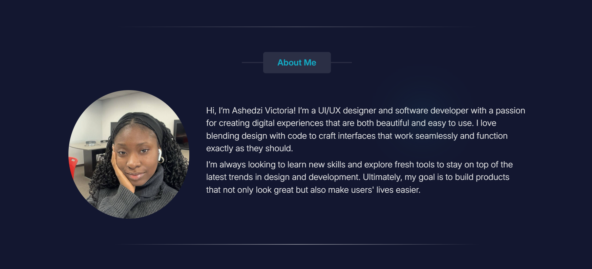

## Portfolio - Ashedzi

#### Overview

This is my personal portfolio website showcasing my work as a UI/UX designer and software developer. It highlights my projects, skills, and experience, providing an insight into my design and development approach

#### Project features 
This portfolio is designed to be **fully responsive**, ensuring a seamless experience across all devices. It incorporates **glassmorphism UI effects**, **interactive hover animations**, and smooth scrolling for a polished look and feel. The site is built with a focus on usability, featuring clear section transitions and an intuitive layout.

#### Technologies used 
- **HTML** – Structuring the content
- **CSS** – Styling with animations and responsiveness
- **JavaScript** – Adding interactivity
